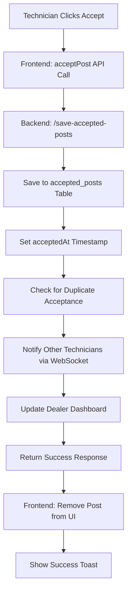
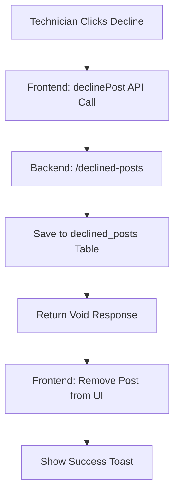

# Direct Accept/Decline Implementation

## 🎯 **Overview**
This document outlines the implementation of direct accept and decline functionality for technicians in the AllStateInspec system, mapping frontend actions to backend endpoints.

## 🔧 **Backend Endpoints**

### **1. Accept Post**
- **Endpoint:** `POST /api/technicians/save-accepted-posts`
- **Request Body:**
  ```json
  {
    "postId": 123,
    "email": "technician@example.com",
    "technicianName": "John Doe"
  }
  ```
- **Response:** `"Accepted successfully"` (string)
- **Backend Actions:**
  - ✅ Saves to `accepted_posts` table
  - ✅ Sets `acceptedAt` timestamp
  - ✅ Prevents duplicate acceptances (409 error if already accepted)
  - ✅ Notifies other technicians via WebSocket
  - ✅ Updates dealer dashboard via Feign client

### **2. Decline Post**
- **Endpoint:** `POST /api/technicians/declined-posts`
- **Request Body:**
  ```json
  {
    "postId": 123,
    "email": "technician@example.com"
  }
  ```
- **Response:** `void` (no response body)
- **Backend Actions:**
  - ✅ Saves to `declined_posts` table
  - ✅ Removes from technician feed (filtered out in `getFilteredFeed`)

## 🎨 **Frontend Implementation**

### **1. API Functions (`technicianApiUtils.js`)**

#### **Accept Post Function:**
```javascript
export const acceptPost = async (postId, technicianEmail, technicianName = null) => {
  const requestBody = {
    email: technicianEmail,
    postId: postId,
  };
  
  if (technicianName) {
    requestBody.technicianName = technicianName;
  }

  const response = await api.post(
    `${API_CONFIG.TECHNICIAN_BASE_URL}/save-accepted-posts`,
    requestBody
  );

  return {
    success: response.status === 200,
    message: response.data || "Post accepted successfully",
    postId: postId,
    acceptedAt: new Date().toISOString(),
    technicianEmail: technicianEmail,
    technicianName: technicianName,
  };
};
```

#### **Decline Post Function:**
```javascript
export const declinePost = async (postId, technicianEmail) => {
  const requestBody = {
    email: technicianEmail,
    postId: postId,
  };

  const response = await api.post(
    `${API_CONFIG.TECHNICIAN_BASE_URL}/declined-posts`,
    requestBody
  );

  return {
    success: true, // Backend returns void, so no error = success
    message: "Post declined successfully",
    postId: postId,
    declinedAt: new Date().toISOString(),
    technicianEmail: technicianEmail,
  };
};
```

### **2. UI Handlers (`TechnicianFeedApp.js`)**

#### **Accept Handler:**
```javascript
const proceedWithRegularAccept = useCallback(async (postId) => {
  const acceptResult = await acceptPost(postId, dealer.email, dealer.name);
  
  if (acceptResult.success) {
    // Optimistic UI update - remove post immediately
    setPosts(prevPosts => prevPosts.filter(post => post.id !== postId));
    console.log("Post accepted successfully:", acceptResult.message);
  } else {
    setError(acceptResult.message);
  }
}, [dealer?.id, dealer?.email, dealer?.name]);
```

#### **Decline Handler:**
```javascript
const proceedWithRegularDecline = useCallback(async (postId) => {
  const declineResult = await declinePost(postId, dealer.email);
  
  if (declineResult.success) {
    // Optimistic UI update - remove post immediately
    setPosts(prevPosts => prevPosts.filter(post => post.id !== postId));
    console.log("Post declined successfully:", declineResult.message);
  } else {
    setError(declineResult.message);
  }
}, [dealer?.id, dealer?.email]);
```

## 🔄 **Data Flow**

### **Accept Flow:**


### **Decline Flow:**


## 🎯 **Key Features**

### **✅ Backend Features:**
- **Duplicate Prevention:** Prevents multiple technicians from accepting same post
- **Real-time Notifications:** WebSocket integration for live updates
- **Data Integrity:** Proper database transactions and error handling
- **Service Communication:** Feign client integration with other microservices

### **✅ Frontend Features:**
- **Optimistic Updates:** Immediate UI updates for better UX
- **Error Handling:** Comprehensive error messages and fallbacks
- **Loading States:** Visual feedback during API calls
- **Toast Notifications:** User-friendly success/error messages

### **✅ Integration Features:**
- **Gateway Routing:** All requests go through API Gateway
- **Service Discovery:** Dynamic service location
- **CORS Handling:** Proper cross-origin request handling

## 🧪 **Testing Scenarios**

### **Accept Post Tests:**
1. ✅ **Successful Accept:** Post accepted, saved to database, removed from feed
2. ✅ **Duplicate Accept:** Returns 409 error if post already accepted
3. ✅ **Invalid Post ID:** Returns 404 error for non-existent post
4. ✅ **Authentication Error:** Returns 401 for invalid/missing token

### **Decline Post Tests:**
1. ✅ **Successful Decline:** Post declined, saved to database, removed from feed
2. ✅ **Invalid Post ID:** Returns 400 error for invalid post
3. ✅ **Authentication Error:** Returns 401 for invalid/missing token

## 🔧 **Error Handling**

### **Accept Errors:**
- **409 Conflict:** Post already accepted by another technician
- **401 Unauthorized:** Authentication required
- **500 Internal Server Error:** Server-side issues

### **Decline Errors:**
- **400 Bad Request:** Invalid request data
- **401 Unauthorized:** Authentication required
- **500 Internal Server Error:** Server-side issues

## 📊 **Database Schema**

### **accepted_posts Table:**
```sql
CREATE TABLE accepted_posts (
    id BIGINT AUTO_INCREMENT PRIMARY KEY,
    email VARCHAR(255) NOT NULL,
    postId BIGINT NOT NULL,
    acceptedAt TIMESTAMP DEFAULT CURRENT_TIMESTAMP
);
```

### **declined_posts Table:**
```sql
CREATE TABLE declined_posts (
    id BIGINT AUTO_INCREMENT PRIMARY KEY,
    email VARCHAR(255) NOT NULL,
    postId BIGINT NOT NULL
);
```

## 🚀 **Deployment Notes**

### **Environment Variables:**
```bash
# API Gateway URL
REACT_APP_API_GATEWAY_URL=http://localhost:8088

# Technician Service URL
REACT_APP_TECHNICIAN_BASE_URL=http://localhost:8088/technician/api/technicians
```

### **Service Dependencies:**
- ✅ **Technician Service:** Core accept/decline functionality
- ✅ **Postings Service:** Post data retrieval
- ✅ **Tech Dashboard Service:** Accepted posts processing
- ✅ **Gateway Service:** API routing and CORS handling

This implementation provides a robust, scalable solution for direct accept/decline functionality with proper error handling, real-time updates, and excellent user experience! 🎯
