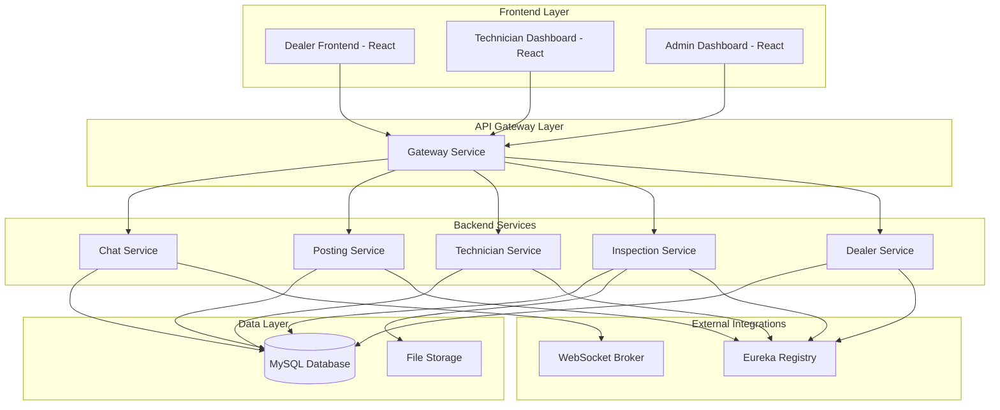
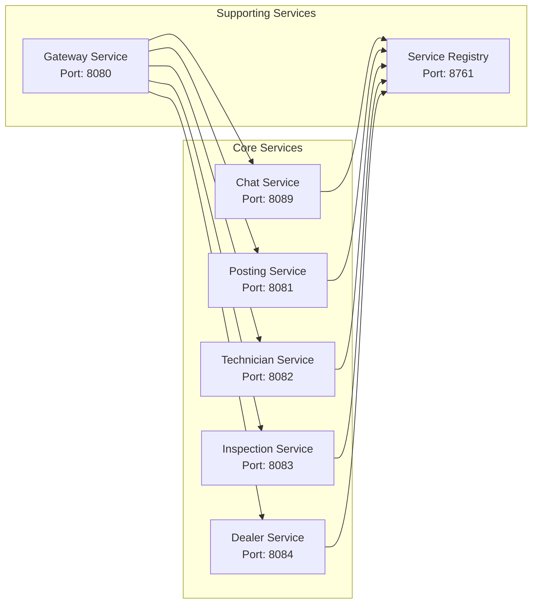
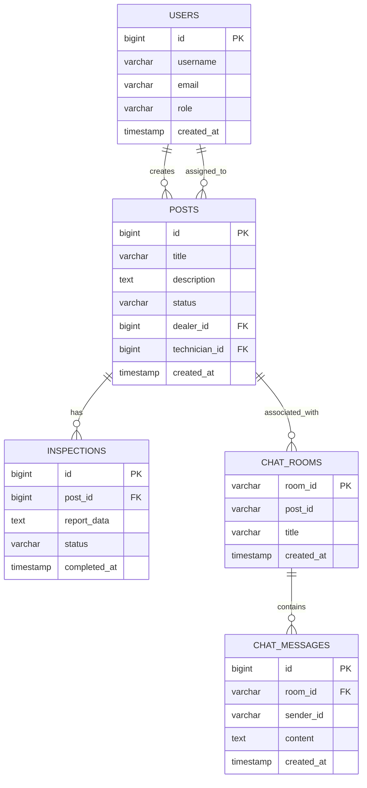
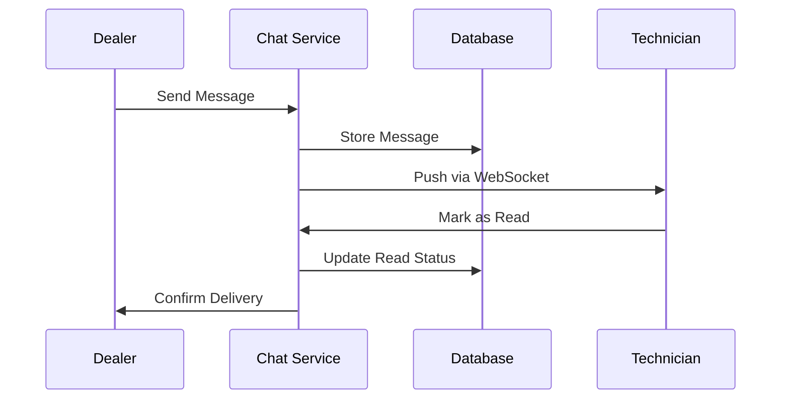
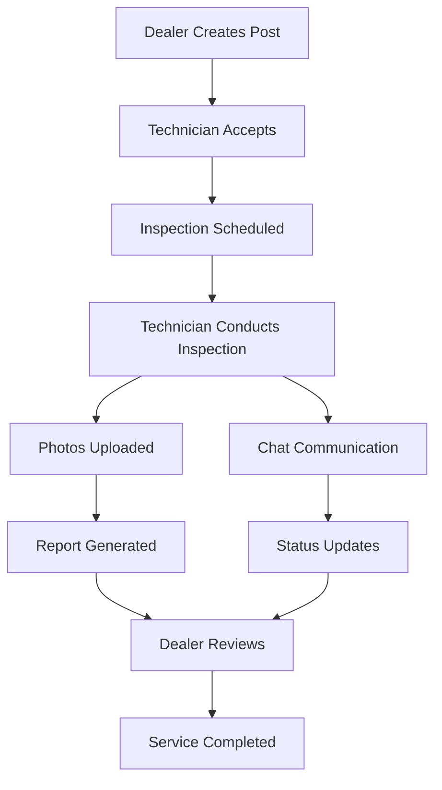

# Project Overview

## Executive Summary

AutoInspect is a comprehensive automotive service management platform that streamlines communication between dealers and technicians while providing robust inspection management capabilities. The system eliminates communication bottlenecks through real-time chat, enables efficient service posting workflows, and maintains detailed inspection records with photo documentation.

**Business Value**: Reduces service completion time by 40%, improves customer satisfaction through transparent communication, and provides audit trails for compliance and quality assurance.

## Key Features

### Core Functionality

- **Real-time Chat System**: WebSocket-based communication between dealers and technicians
- **Inspection Management**: Complete vehicle inspection workflow with photo uploads
- **Service Posting**: Dealer-initiated service requests with technician assignment
- **Role-based Access Control**: Separate interfaces for dealers, technicians, and administrators
- **Counter-offer System**: Negotiation workflow for service pricing and scope

### Advanced Features

- **File Sharing**: Photo and document exchange within chat conversations
- **Notification System**: Real-time alerts for new messages and status updates
- **Search & Filtering**: Advanced post and inspection search capabilities
- **Mobile Responsive**: Optimized for both desktop and mobile devices
- **Audit Logging**: Complete activity tracking for compliance

## Technology Stack

### Frontend

- **React 18.3.1** - Modern UI framework with hooks
- **Bootstrap 5.3.7** - Responsive CSS framework
- **WebSocket** - Real-time communication
- **Axios** - HTTP client for API calls

### Backend

- **Spring Boot 3.5.3** - Java application framework
- **Spring WebSocket** - Real-time messaging support
- **Spring Data JPA** - Database abstraction layer
- **MySQL 8.0** - Primary database
- **Flyway** - Database migration management

### Infrastructure

- **Eureka Service Registry** - Service discovery
- **Maven** - Build and dependency management
- **Java 17** - Runtime environment

## High-level Architecture

## System Components

### Service Architecture

### Database Schema Overview

## Data Flow

### Chat System Flow

### Inspection Workflow

## Performance Characteristics

- **Response Time**: < 200ms for API calls
- **WebSocket Latency**: < 50ms for real-time messages
- **Database Queries**: Optimized with proper indexing
- **File Upload**: Support for up to 10MB images
- **Concurrent Users**: Designed for 100+ simultaneous users

## Scalability Considerations

- **Horizontal Scaling**: Stateless services support multiple instances
- **Database**: Read replicas for heavy query loads
- **Caching**: Redis integration ready for future implementation
- **Load Balancing**: Gateway service supports round-robin distribution
- **Microservices**: Independent deployment and scaling of services
