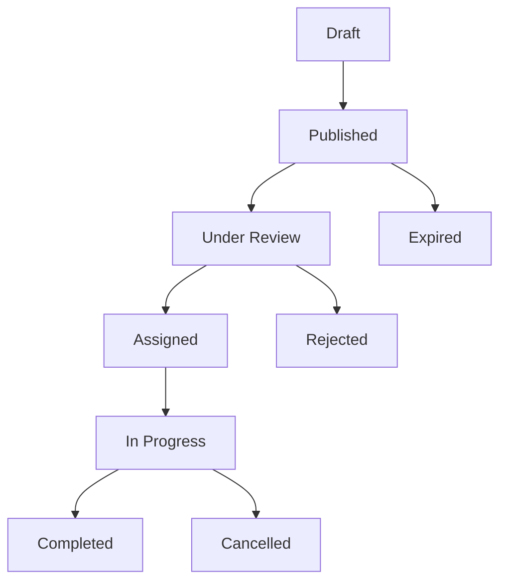

# User Guide

## Getting Started

### Accessing the Application

1. **Open your web browser** and navigate to: `https://your-domain.com`
2. **Click "Login"** in the top-right corner
3. **Enter your credentials**:
   - Username: Your assigned username
   - Password: Your temporary password (change on first login)
4. **Click "Sign In"**

### First-Time Setup

#### Change Password

1. After first login, you'll be prompted to change your password
2. Enter your current password
3. Create a new strong password (minimum 8 characters)
4. Confirm the new password
5. Click "Update Password"

#### Profile Setup

1. Click your username in the top-right corner
2. Select "Profile Settings"
3. Upload a profile photo (optional)
4. Update contact information
5. Save changes

## Role-Based Access

### Dealer Access

#### Dashboard Overview

- **Active Posts**: View all your service requests
- **Recent Inspections**: Quick access to latest reports
- **Chat Conversations**: Unread message indicators
- **Quick Actions**: Create new post, view analytics

#### Creating Service Posts

1. **Click "New Post"** button
2. **Fill in details**:
   - Title: Brief description of service needed
   - Description: Detailed requirements
   - Vehicle Information: Make, model, year
   - Photos: Upload relevant images
   - Urgency: Low, Medium, High
3. **Click "Submit Post"**

#### Managing Posts

- **View Status**: Track progress of each post
- **Edit Details**: Modify post information before assignment
- **Cancel Post**: Remove unassigned posts
- **Add Photos**: Upload additional images

#### Chat with Technicians

1. **Click on a post** to open details
2. **Click "Chat"** button
3. **Type your message** and press Enter
4. **View real-time responses**
5. **Upload files** by clicking the attachment icon

### Technician Access

#### Dashboard Overview

- **Available Posts**: Open service requests
- **My Assignments**: Currently assigned work
- **Recent Inspections**: Your completed work
- **Performance Metrics**: Completion rates, ratings

#### Accepting Work

1. **Browse available posts** in the feed
2. **Click on a post** to view details
3. **Review requirements** and photos
4. **Click "Accept Post"** if interested
5. **Set estimated completion time**

#### Conducting Inspections

1. **Navigate to assigned post**
2. **Click "Start Inspection"**
3. **Follow inspection checklist**:
   - Engine compartment
   - Interior condition
   - Exterior body
   - Test drive (if applicable)
4. **Upload photos** for each section
5. **Add notes** and observations
6. **Click "Complete Inspection"**

#### Communication with Dealers

- **Real-time chat** for quick questions
- **Photo sharing** for clarification
- **Status updates** on progress
- **Request additional information**

### Administrator Access

#### System Overview

- **User Management**: Add, edit, deactivate users
- **Service Monitoring**: Track system performance
- **Analytics Dashboard**: Business metrics and reports
- **System Configuration**: Feature flags and settings

#### User Management

1. **Navigate to "Users"** section
2. **Click "Add User"** for new accounts
3. **Set role and permissions**:
   - Dealer: Can create posts and chat
   - Technician: Can accept work and conduct inspections
   - Admin: Full system access
4. **Assign initial password**
5. **Set account status** (Active/Inactive)

## Core Features

### Real-Time Chat System

#### Starting Conversations

1. **Navigate to any post or user**
2. **Click the chat icon**
3. **Type your message**
4. **Press Enter to send**

#### Chat Features

- **Typing indicators**: See when someone is typing
- **Read receipts**: Know when messages are read
- **File sharing**: Upload photos and documents
- **Message search**: Find specific conversations
- **Chat history**: Access previous conversations

#### Chat Best Practices

- **Be concise** and clear
- **Use photos** for visual issues
- **Respond promptly** to urgent matters
- **Keep professional tone**

### Inspection Management

#### Creating Inspection Reports

1. **Open assigned post**
2. **Click "New Inspection"**
3. **Select inspection type**:
   - Pre-purchase inspection
   - Maintenance check
   - Damage assessment
   - Performance evaluation
4. **Follow structured checklist**
5. **Upload photos** for each section
6. **Add detailed notes**
7. **Set inspection status**

#### Photo Management

- **Upload multiple images** per section
- **Organize by category** (engine, interior, exterior)
- **Add annotations** to highlight issues
- **Compress large files** automatically

#### Report Generation

1. **Complete all inspection sections**
2. **Review photos and notes**
3. **Generate PDF report**
4. **Send to dealer** via chat or email
5. **Archive for future reference**

### Service Posting Workflow

#### Post Lifecycle

#### Status Management

- **Draft**: Work in progress, not visible to technicians
- **Published**: Available for technician review
- **Under Review**: Being evaluated by technicians
- **Assigned**: Work accepted by technician
- **In Progress**: Inspection/repair underway
- **Completed**: Work finished, report delivered
- **Cancelled**: Post removed from system

## Advanced Features

### Counter-Offer System

#### Making Counter-Offers

1. **Review technician's proposal**
2. **Click "Make Counter-Offer"**
3. **Adjust terms**:
   - Price modifications
   - Timeline changes
   - Scope adjustments
4. **Add justification** for changes
5. **Submit counter-offer**

#### Negotiation Workflow

- **Multiple rounds** of offers
- **Automatic notifications** for responses
- **Deadline tracking** for offers
- **Acceptance/rejection** tracking

### File Management

#### Uploading Files

1. **Click attachment icon** in chat or forms
2. **Select file** from your device
3. **Choose category** (photo, document, video)
4. **Add description** (optional)
5. **Click "Upload"**

#### Supported File Types

- **Images**: JPEG, PNG, GIF (max 10MB)
- **Documents**: PDF, DOC, DOCX (max 25MB)
- **Videos**: MP4, MOV (max 100MB)

#### File Organization

- **Automatic categorization** by type
- **Search functionality** across all files
- **Version control** for updated documents
- **Secure storage** with access controls

### Notification System

#### Notification Types

- **New messages** in chat
- **Post updates** and status changes
- **Inspection completions**
- **System announcements**
- **Deadline reminders**

#### Managing Notifications

1. **Click notification bell** icon
2. **View all notifications** in dropdown
3. **Mark as read** by clicking
4. **Configure preferences** in settings

## Troubleshooting

### Common Issues

#### Login Problems

- **Forgot password**: Click "Reset Password" link
- **Account locked**: Contact administrator
- **Invalid credentials**: Check username/password

#### Chat Issues

- **Messages not sending**: Check internet connection
- **Photos not uploading**: Verify file size and format
- **Real-time updates**: Refresh page if needed

#### File Upload Problems

- **File too large**: Compress or resize images
- **Unsupported format**: Convert to supported type
- **Upload timeout**: Check internet speed

### Performance Tips

#### Browser Optimization

- **Use Chrome or Firefox** for best performance
- **Clear cache** regularly
- **Disable unnecessary extensions**

#### Network Considerations

- **Stable internet connection** required
- **Upload large files** during off-peak hours
- **Use wired connection** when possible

### Getting Help

#### Support Channels

1. **In-app help**: Click "?" icon for context help
2. **User manual**: Access comprehensive documentation
3. **Technical support**: Contact system administrator
4. **Training sessions**: Schedule with your team

#### Contact Information

- **System Administrator**: admin@your-domain.com
- **Technical Support**: support@your-domain.com
- **Emergency Contact**: +1-555-0123 (24/7)

## Known Limitations

### Current Constraints

- **File size limits**: Photos (10MB), Documents (25MB), Videos (100MB)
- **Concurrent users**: Maximum 100 simultaneous users
- **Mobile devices**: Limited functionality on older devices
- **Offline mode**: Not currently supported

### Planned Improvements

- **Mobile app**: Native iOS and Android applications
- **Offline capability**: Work without internet connection
- **Advanced analytics**: Business intelligence dashboard
- **Integration APIs**: Third-party system connections

## Best Practices

### Communication

- **Respond promptly** to messages
- **Use clear, professional language**
- **Include relevant photos** when describing issues
- **Set expectations** for response times

### File Management

- **Organize photos** by category
- **Use descriptive filenames**
- **Compress large images** before upload
- **Archive completed work** regularly

### Workflow Efficiency

- **Update post status** promptly
- **Complete inspections** thoroughly
- **Document all findings** with photos
- **Follow up** on completed work

### Security

- **Log out** when leaving your computer
- **Use strong passwords** and change regularly
- **Report suspicious activity** immediately
- **Don't share credentials** with others
