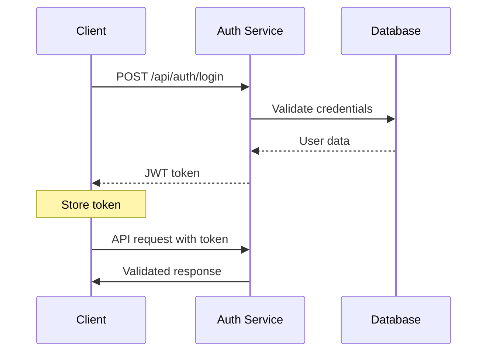

# API Documentation

## Overview

The AutoInspect API provides RESTful endpoints for managing automotive inspections, service postings, and real-time communication. All endpoints return JSON responses and use standard HTTP status codes.

## Base URL

- **Development**: `http://localhost:8080`
- **Production**: `https://your-domain.com`

## Authentication

### JWT Token Authentication

All API endpoints require a valid JWT token in the Authorization header.

```http
Authorization: Bearer <your_jwt_token>
```

### Authentication Flow



### Getting a Token

```http
POST /api/auth/login
Content-Type: application/json

{
  "username": "dealer@example.com",
  "password": "your_password"
}
```

**Response:**

```json
{
  "token": "eyJhbGciOiJIUzI1NiIsInR5cCI6IkpXVCJ9...",
  "refreshToken": "refresh_token_here",
  "expiresIn": 3600,
  "user": {
    "id": 123,
    "username": "dealer@example.com",
    "role": "DEALER",
    "name": "John Doe"
  }
}
```

## Chat Service API

### Base URL: `/api/chat`

#### Get Chat Messages

```http
GET /api/chat/{roomId}/messages?limit=50&afterId=123
Authorization: Bearer <token>
```

**Parameters:**

- `roomId` (path): Chat room identifier
- `limit` (query): Maximum number of messages (default: 50)
- `afterId` (query): Get messages after this ID

**Response:**

```json
[
  {
    "id": 456,
    "roomId": "post-123",
    "sender": "dealer@example.com",
    "senderName": "John Doe",
    "type": "TEXT",
    "content": "When can you start the inspection?",
    "createdAt": "2025-01-15T10:30:00Z"
  }
]
```

#### Send Message

```http
POST /api/chat/{roomId}/send
Authorization: Bearer <token>
Content-Type: application/json

{
  "sender": "dealer@example.com",
  "content": "Please let me know the inspection results",
  "type": "TEXT"
}
```

**Response:**

```json
{
  "id": 789,
  "roomId": "post-123",
  "senderId": "dealer@example.com",
  "senderName": "John Doe",
  "messageType": "TEXT",
  "content": "Please let me know the inspection results",
  "createdAt": "2025-01-15T10:35:00Z"
}
```

#### Get Room Statistics

```http
GET /api/chat/{roomId}/stats
Authorization: Bearer <token>
```

**Response:**

```json
{
  "roomId": "post-123",
  "messageCount": 15,
  "participantCount": 2
}
```

#### Get Unread Messages Count

```http
GET /api/chat/technician/{technicianId}/unread
Authorization: Bearer <token>
```

**Response:**

```json
{
  "totalUnread": 5,
  "recentChats": [
    {
      "roomId": "post-123",
      "postId": "123",
      "postTitle": "Post #123",
      "unreadCount": 3,
      "lastMessage": {
        "content": "Inspection completed",
        "timestamp": "2025-01-15T10:30:00Z",
        "sender": "John Doe"
      }
    }
  ]
}
```

#### Mark Messages as Read

```http
POST /api/chat/{roomId}/read
Authorization: Bearer <token>
Content-Type: application/json

{
  "userId": "technician@example.com"
}
```

**Response:**

```json
{
  "success": true,
  "message": "Messages marked as read",
  "roomId": "post-123",
  "userId": "technician@example.com"
}
```

## Posting Service API

### Base URL: `/api/posts`

#### Get All Posts

```http
GET /api/posts?status=OPEN&page=0&size=20
Authorization: Bearer <token>
```

**Parameters:**

- `status` (query): Filter by status (OPEN, ASSIGNED, IN_PROGRESS, COMPLETED)
- `page` (query): Page number (default: 0)
- `size` (query): Page size (default: 20)

**Response:**

```json
{
  "content": [
    {
      "id": 123,
      "title": "Engine Diagnostic Needed",
      "description": "Vehicle making unusual noise",
      "status": "OPEN",
      "dealerId": 456,
      "dealerName": "ABC Motors",
      "createdAt": "2025-01-15T09:00:00Z",
      "urgency": "HIGH"
    }
  ],
  "totalElements": 45,
  "totalPages": 3,
  "size": 20,
  "number": 0
}
```

#### Create New Post

```http
POST /api/posts
Authorization: Bearer <token>
Content-Type: application/json

{
  "title": "Brake System Inspection",
  "description": "Customer reports brake pedal feels soft",
  "vehicleInfo": {
    "make": "Toyota",
    "model": "Camry",
    "year": 2020,
    "vin": "1HGBH41JXMN109186"
  },
  "urgency": "MEDIUM",
  "photos": ["photo1.jpg", "photo2.jpg"]
}
```

**Response:**

```json
{
  "id": 124,
  "title": "Brake System Inspection",
  "description": "Customer reports brake pedal feels soft",
  "status": "OPEN",
  "dealerId": 456,
  "createdAt": "2025-01-15T11:00:00Z",
  "urgency": "MEDIUM"
}
```

#### Update Post

```http
PUT /api/posts/{postId}
Authorization: Bearer <token>
Content-Type: application/json

{
  "title": "Brake System Inspection - Updated",
  "description": "Customer reports brake pedal feels soft, also check ABS",
  "urgency": "HIGH"
}
```

#### Delete Post

```http
DELETE /api/posts/{postId}
Authorization: Bearer <token>
```

**Response:** `204 No Content`

## Inspection Service API

### Base URL: `/api/inspections`

#### Create Inspection

```http
POST /api/inspections
Authorization: Bearer <token>
Content-Type: application/json

{
  "postId": 123,
  "technicianId": 789,
  "inspectionType": "PRE_PURCHASE",
  "scheduledDate": "2025-01-16T14:00:00Z",
  "notes": "Customer requested comprehensive inspection"
}
```

#### Update Inspection Status

```http
PATCH /api/inspections/{inspectionId}/status
Authorization: Bearer <token>
Content-Type: application/json

{
  "status": "IN_PROGRESS",
  "notes": "Started engine compartment inspection"
}
```

#### Upload Inspection Photos

```http
POST /api/inspections/{inspectionId}/photos
Authorization: Bearer <token>
Content-Type: multipart/form-data

photo: [binary file]
category: "ENGINE"
description: "Oil leak near valve cover"
```

#### Complete Inspection

```http
POST /api/inspections/{inspectionId}/complete
Authorization: Bearer <token>
Content-Type: application/json

{
  "findings": [
    {
      "category": "ENGINE",
      "issue": "Minor oil leak",
      "severity": "LOW",
      "recommendation": "Monitor and repair if worsens",
      "photos": ["photo1.jpg", "photo2.jpg"]
    }
  ],
  "overallCondition": "GOOD",
  "estimatedRepairCost": 150.00,
  "recommendations": "Schedule oil change and monitor leak"
}
```

## User Management API

### Base URL: `/api/users`

#### Get User Profile

```http
GET /api/users/profile
Authorization: Bearer <token>
```

**Response:**

```json
{
  "id": 456,
  "username": "dealer@example.com",
  "email": "dealer@example.com",
  "role": "DEALER",
  "name": "John Doe",
  "company": "ABC Motors",
  "phone": "+1-555-0123",
  "createdAt": "2024-01-01T00:00:00Z"
}
```

#### Update Profile

```http
PUT /api/users/profile
Authorization: Bearer <token>
Content-Type: application/json

{
  "name": "John Smith",
  "phone": "+1-555-0124",
  "company": "ABC Motors Inc."
}
```

#### Change Password

```http
POST /api/users/change-password
Authorization: Bearer <token>
Content-Type: application/json

{
  "currentPassword": "old_password",
  "newPassword": "new_secure_password"
}
```

## WebSocket API

### Connection

```javascript
const socket = new WebSocket("ws://localhost:8089/ws");
```

### Message Format

```json
{
  "type": "CHAT_MESSAGE",
  "roomId": "post-123",
  "sender": "dealer@example.com",
  "content": "Hello, how's the inspection going?",
  "timestamp": "2025-01-15T10:30:00Z"
}
```

### Message Types

- `CHAT_MESSAGE`: Regular chat message
- `TYPING_INDICATOR`: User is typing
- `STATUS_UPDATE`: Post or inspection status change
- `NOTIFICATION`: System notification

## Error Handling

### Standard Error Response

```json
{
  "timestamp": "2025-01-15T10:30:00Z",
  "status": 400,
  "error": "Bad Request",
  "message": "Validation failed",
  "path": "/api/posts",
  "details": [
    {
      "field": "title",
      "message": "Title is required"
    }
  ]
}
```

### HTTP Status Codes

| Code | Description                              |
| ---- | ---------------------------------------- |
| 200  | OK - Request successful                  |
| 201  | Created - Resource created successfully  |
| 400  | Bad Request - Invalid input              |
| 401  | Unauthorized - Authentication required   |
| 403  | Forbidden - Insufficient permissions     |
| 404  | Not Found - Resource not found           |
| 409  | Conflict - Resource already exists       |
| 422  | Unprocessable Entity - Validation failed |
| 500  | Internal Server Error - Server error     |

### Common Error Codes

| Error Code | Description                | Solution              |
| ---------- | -------------------------- | --------------------- |
| `AUTH_001` | Invalid token              | Re-authenticate       |
| `AUTH_002` | Token expired              | Refresh token         |
| `AUTH_003` | Insufficient permissions   | Contact administrator |
| `VAL_001`  | Required field missing     | Check request body    |
| `VAL_002`  | Invalid format             | Verify data format    |
| `DB_001`   | Database connection failed | Contact support       |
| `FILE_001` | File too large             | Reduce file size      |
| `FILE_002` | Unsupported format         | Use supported format  |

## Rate Limiting

### Limits

- **Authentication endpoints**: 5 requests per minute
- **Chat endpoints**: 100 requests per minute
- **File uploads**: 10 requests per minute
- **General API**: 1000 requests per hour

### Headers

```http
X-RateLimit-Limit: 1000
X-RateLimit-Remaining: 999
X-RateLimit-Reset: 1642248000
```

## Pagination

### Standard Pagination Response

```json
{
  "content": [...],
  "pageable": {
    "sort": {
      "sorted": true,
      "unsorted": false
    },
    "pageNumber": 0,
    "pageSize": 20,
    "offset": 0,
    "paged": true,
    "unpaged": false
  },
  "totalElements": 100,
  "totalPages": 5,
  "last": false,
  "first": true,
  "sort": {
    "sorted": true,
    "unsorted": false
  },
  "numberOfElements": 20,
  "size": 20,
  "number": 0
}
```

## File Upload

### Supported Formats

- **Images**: JPEG, PNG, GIF, WebP
- **Documents**: PDF, DOC, DOCX, TXT
- **Videos**: MP4, MOV, AVI

### Upload Limits

- **Images**: 10MB per file
- **Documents**: 25MB per file
- **Videos**: 100MB per file

### Upload Response

```json
{
  "id": "file_123",
  "filename": "inspection_photo.jpg",
  "size": 2048576,
  "mimeType": "image/jpeg",
  "url": "/uploads/inspections/file_123.jpg",
  "uploadedAt": "2025-01-15T10:30:00Z"
}
```

## Testing

### Postman Collection

Import the following collection for testing:

```json
{
  "info": {
    "name": "AutoInspect API",
    "description": "Complete API collection for testing"
  },
  "item": [
    {
      "name": "Authentication",
      "item": [
        {
          "name": "Login",
          "request": {
            "method": "POST",
            "url": "{{baseUrl}}/api/auth/login",
            "body": {
              "mode": "raw",
              "raw": "{\n  \"username\": \"test@example.com\",\n  \"password\": \"password\"\n}",
              "options": {
                "raw": {
                  "language": "json"
                }
              }
            }
          }
        }
      ]
    }
  ]
}
```

### Environment Variables

Set these variables in your testing environment:

```bash
baseUrl=http://localhost:8080
token=your_jwt_token_here
roomId=post-123
postId=123
inspectionId=456
```
