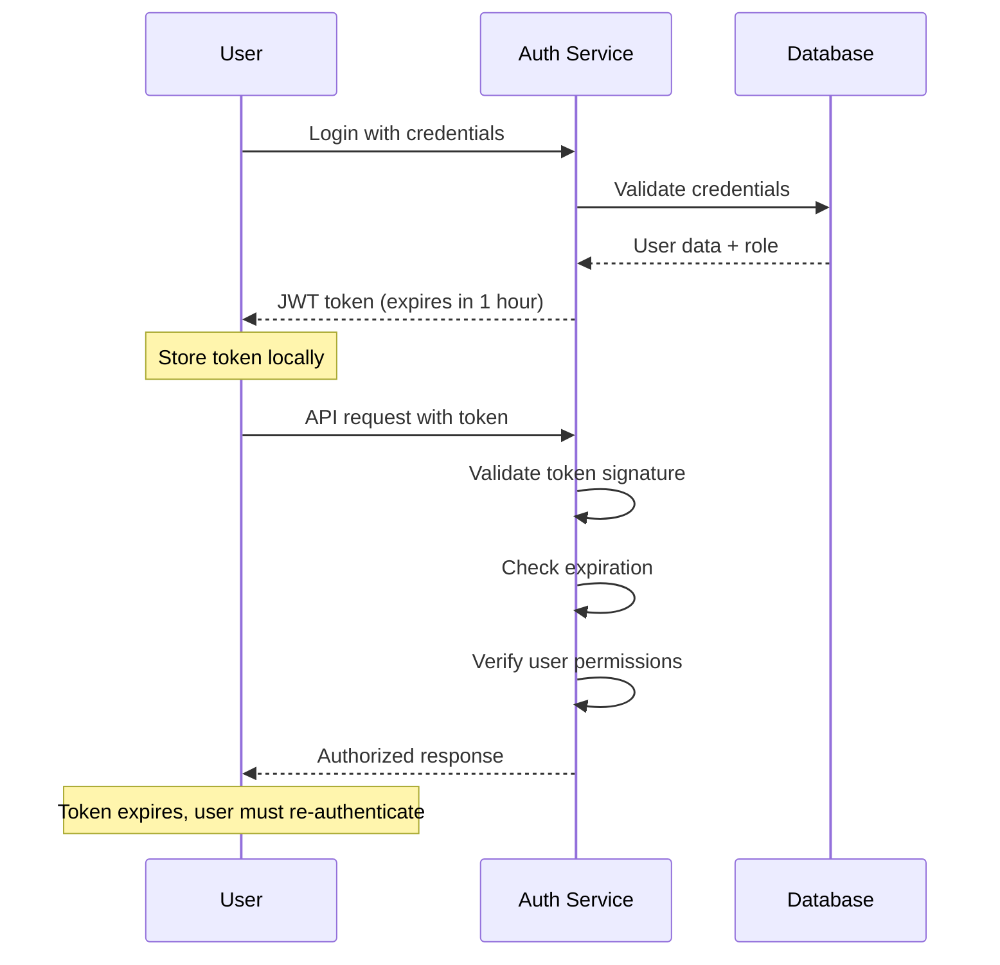
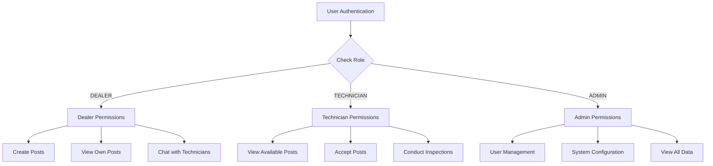
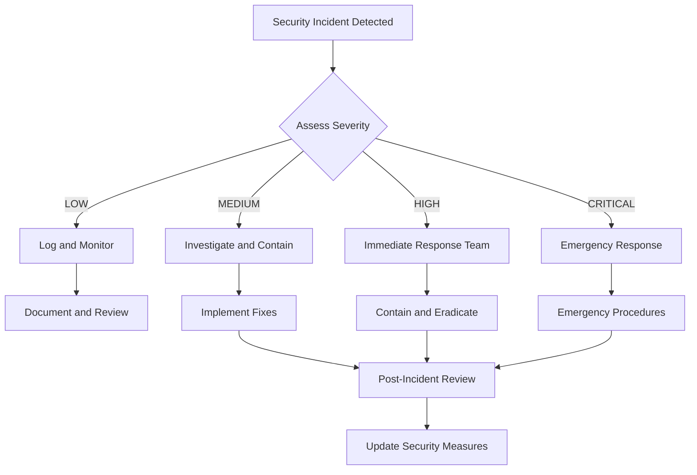

# Security & Compliance Notes

## Authentication & Authorization

### JWT Token Implementation

#### Token Structure

```json
{
  "header": {
    "alg": "HS256",
    "typ": "JWT"
  },
  "payload": {
    "sub": "user123",
    "username": "dealer@example.com",
    "role": "DEALER",
    "iat": 1642248000,
    "exp": 1642251600,
    "jti": "unique_token_id"
  },
  "signature": "HMACSHA256(base64UrlEncode(header) + '.' + base64UrlEncode(payload), secret)"
}
```

#### Token Lifecycle



#### Security Features

- **Secret Key**: 256-bit minimum, stored in environment variables
- **Expiration**: 1-hour default, configurable per environment
- **Refresh Tokens**: Separate refresh token for extended sessions
- **Token Rotation**: New token issued on each refresh
- **Blacklisting**: Revoked tokens stored in Redis for immediate invalidation

### Role-Based Access Control (RBAC)

#### User Roles

| Role           | Permissions                                               | Access Level             |
| -------------- | --------------------------------------------------------- | ------------------------ |
| **DEALER**     | Create posts, chat with technicians, view inspections     | Limited to own data      |
| **TECHNICIAN** | Accept posts, conduct inspections, chat with dealers      | Limited to assigned work |
| **ADMIN**      | Full system access, user management, system configuration | Complete access          |

#### Permission Matrix



#### API Endpoint Security

```java
@RestController
@RequestMapping("/api/posts")
public class PostController {

    @PreAuthorize("hasRole('DEALER') or hasRole('ADMIN')")
    @PostMapping
    public ResponseEntity<Post> createPost(@RequestBody PostRequest request) {
        // Only dealers and admins can create posts
    }

    @PreAuthorize("hasRole('TECHNICIAN') or hasRole('ADMIN')")
    @PostMapping("/{postId}/accept")
    public ResponseEntity<Post> acceptPost(@PathVariable Long postId) {
        // Only technicians and admins can accept posts
    }

    @PreAuthorize("@postSecurityService.canAccessPost(#postId, principal.username)")
    @GetMapping("/{postId}")
    public ResponseEntity<Post> getPost(@PathVariable Long postId) {
        // Users can only access posts they're involved with
    }
}
```

## Data Security

### Encryption Standards

#### Data at Rest

- **Database Encryption**: MySQL Enterprise Encryption or application-level encryption
- **File Storage**: AES-256 encryption for uploaded files
- **Backup Encryption**: Encrypted backups with strong keys
- **Configuration Files**: Encrypted sensitive configuration values

#### Data in Transit

- **HTTPS/TLS**: TLS 1.3 for all web communications
- **API Security**: All API endpoints require HTTPS
- **WebSocket Security**: WSS (WebSocket Secure) for real-time communications
- **Database Connections**: SSL/TLS for database connections

#### Encryption Implementation

```java
@Component
public class EncryptionService {

    private static final String ALGORITHM = "AES/GCM/NoPadding";
    private static final int KEY_SIZE = 256;

    public String encrypt(String data, String key) throws Exception {
        SecretKey secretKey = generateKey(key);
        Cipher cipher = Cipher.getInstance(ALGORITHM);
        cipher.init(Cipher.ENCRYPT_MODE, secretKey);

        byte[] encryptedData = cipher.doFinal(data.getBytes());
        return Base64.getEncoder().encodeToString(encryptedData);
    }

    public String decrypt(String encryptedData, String key) throws Exception {
        SecretKey secretKey = generateKey(key);
        Cipher cipher = Cipher.getInstance(ALGORITHM);
        cipher.init(Cipher.DECRYPT_MODE, secretKey);

        byte[] decryptedData = cipher.doFinal(
            Base64.getDecoder().decode(encryptedData)
        );
        return new String(decryptedData);
    }
}
```

### Data Classification

#### Sensitivity Levels

| Level            | Description                  | Examples                             | Protection Required         |
| ---------------- | ---------------------------- | ------------------------------------ | --------------------------- |
| **PUBLIC**       | Non-sensitive information    | Company name, general features       | Basic access control        |
| **INTERNAL**     | Company internal information | User roles, system status            | Authentication required     |
| **CONFIDENTIAL** | Sensitive business data      | Inspection reports, chat messages    | Encryption + access control |
| **RESTRICTED**   | Highly sensitive data        | Financial information, personal data | Maximum security measures   |

#### Data Handling by Type

```java
@RestController
public class DataController {

    @PreAuthorize("hasRole('ADMIN')")
    @GetMapping("/admin/analytics")
    public ResponseEntity<AnalyticsData> getAnalytics() {
        // RESTRICTED data - admin only
    }

    @PreAuthorize("hasRole('DEALER') or hasRole('TECHNICIAN')")
    @GetMapping("/posts/{postId}/details")
    public ResponseEntity<PostDetails> getPostDetails(@PathVariable Long postId) {
        // CONFIDENTIAL data - role-based access
    }

    @GetMapping("/public/features")
    public ResponseEntity<FeatureList> getFeatures() {
        // PUBLIC data - no authentication required
    }
}
```

### File Upload Security

#### File Validation

```java
@Component
public class FileSecurityService {

    private static final Set<String> ALLOWED_EXTENSIONS = Set.of(
        "jpg", "jpeg", "png", "gif", "pdf", "doc", "docx"
    );

    private static final long MAX_FILE_SIZE = 10 * 1024 * 1024; // 10MB

    public void validateFile(MultipartFile file) throws SecurityException {
        // Check file size
        if (file.getSize() > MAX_FILE_SIZE) {
            throw new SecurityException("File size exceeds maximum allowed");
        }

        // Check file extension
        String extension = getFileExtension(file.getOriginalFilename());
        if (!ALLOWED_EXTENSIONS.contains(extension.toLowerCase())) {
            throw new SecurityException("File type not allowed");
        }

        // Check file content (MIME type validation)
        if (!isValidMimeType(file.getContentType())) {
            throw new SecurityException("Invalid file content type");
        }

        // Scan for malware (if antivirus integration available)
        if (isMalwareDetected(file)) {
            throw new SecurityException("File contains potential security threats");
        }
    }
}
```

#### Secure File Storage

```java
@Service
public class SecureFileService {

    @Value("${file.upload.path}")
    private String uploadPath;

    @Value("${file.encryption.key}")
    private String encryptionKey;

    public String storeFileSecurely(MultipartFile file) throws Exception {
        // Generate unique filename
        String filename = generateSecureFilename(file.getOriginalFilename());

        // Encrypt file content
        byte[] encryptedContent = encryptionService.encrypt(
            file.getBytes(),
            encryptionKey
        );

        // Store encrypted file
        Path filePath = Paths.get(uploadPath, filename);
        Files.write(filePath, encryptedContent);

        // Set restrictive permissions
        Files.setPosixFilePermissions(filePath,
            PosixFilePermissions.fromString("rw-------")
        );

        return filename;
    }
}
```

## Network Security

### Firewall Configuration

#### Inbound Rules

```bash
# Allow SSH (restricted to specific IPs)
sudo ufw allow from 192.168.1.0/24 to any port 22

# Allow HTTP/HTTPS
sudo ufw allow 80/tcp
sudo ufw allow 443/tcp

# Allow application ports
sudo ufw allow 8080/tcp  # Gateway
sudo ufw allow 8089/tcp  # Chat Service
sudo ufw allow 3306/tcp  # MySQL (restricted to internal network)

# Block all other inbound traffic
sudo ufw default deny incoming
```

#### Outbound Rules

```bash
# Allow established connections
sudo ufw allow out on eth0

# Allow DNS queries
sudo ufw allow out 53/udp

# Allow HTTP/HTTPS for updates
sudo ufw allow out 80/tcp
sudo ufw allow out 443/tcp

# Block all other outbound traffic
sudo ufw default deny outgoing
```

### Network Segmentation

#### DMZ Configuration

```mermaid
graph TB
    subgraph "Internet"
        A[External Users]
    end

    subgraph "DMZ"
        B[Load Balancer]
        C[Web Server]
        D[API Gateway]
    end

    subgraph "Internal Network"
        E[Application Services]
        F[Database Server]
        G[File Storage]
    end

    A --> B
    B --> C
    B --> D
    D --> E
    E --> F
    E --> G

    style DMZ fill:#ffcccc
    style "Internal Network" fill:#ccffcc
```

#### VLAN Configuration

```bash
# Create VLANs for network segmentation
sudo vconfig add eth0 10  # DMZ VLAN
sudo vconfig add eth0 20  # Application VLAN
sudo vconfig add eth0 30  # Database VLAN

# Configure VLAN interfaces
sudo ip addr add 192.168.10.1/24 dev eth0.10
sudo ip addr add 192.168.20.1/24 dev eth0.20
sudo ip addr add 192.168.30.1/24 dev eth0.30
```

## Application Security

### Input Validation

#### Request Validation

```java
@RestController
public class SecureController {

    @PostMapping("/api/posts")
    public ResponseEntity<Post> createPost(
            @Valid @RequestBody PostRequest request,
            BindingResult bindingResult) {

        if (bindingResult.hasErrors()) {
            throw new ValidationException("Invalid input data");
        }

        // Additional business logic validation
        validateBusinessRules(request);

        return postService.createPost(request);
    }

    private void validateBusinessRules(PostRequest request) {
        // Check for SQL injection patterns
        if (containsSqlInjection(request.getTitle()) ||
            containsSqlInjection(request.getDescription())) {
            throw new SecurityException("Invalid input detected");
        }

        // Check for XSS patterns
        if (containsXssPatterns(request.getTitle()) ||
            containsXssPatterns(request.getDescription())) {
            throw new SecurityException("Invalid input detected");
        }
    }
}
```

#### SQL Injection Prevention

```java
@Repository
public class SecurePostRepository {

    // Use parameterized queries
    @Query("SELECT p FROM Post p WHERE p.dealerId = :dealerId AND p.status = :status")
    List<Post> findByDealerAndStatus(
        @Param("dealerId") Long dealerId,
        @Param("status") String status
    );

    // Avoid string concatenation in queries
    // WRONG: "SELECT * FROM posts WHERE title LIKE '%" + searchTerm + "%'"
    // RIGHT: Use @Query with parameters
    @Query("SELECT p FROM Post p WHERE p.title LIKE %:searchTerm%")
    List<Post> searchByTitle(@Param("searchTerm") String searchTerm);
}
```

### Session Management

#### Session Configuration

```properties
# Session timeout (30 minutes)
server.servlet.session.timeout=30m

# Secure session cookies
server.servlet.session.cookie.secure=true
server.servlet.session.cookie.http-only=true
server.servlet.session.cookie.same-site=strict

# Session fixation protection
server.servlet.session.fixation=changeSessionId
```

#### Session Security

```java
@Component
public class SessionSecurityService {

    public void validateSession(HttpSession session) {
        // Check session age
        long sessionAge = System.currentTimeMillis() - session.getCreationTime();
        if (sessionAge > MAX_SESSION_AGE) {
            session.invalidate();
            throw new SecurityException("Session expired");
        }

        // Check for concurrent sessions
        if (hasConcurrentSessions(session.getAttribute("userId"))) {
            session.invalidate();
            throw new SecurityException("Concurrent session detected");
        }

        // Validate session attributes
        if (!isValidSessionData(session)) {
            session.invalidate();
            throw new SecurityException("Invalid session data");
        }
    }
}
```

## Compliance Requirements

### GDPR Compliance

#### Data Processing Principles

- **Lawful Basis**: Contract performance and legitimate interest
- **Data Minimization**: Only collect necessary data
- **Purpose Limitation**: Use data only for specified purposes
- **Data Accuracy**: Maintain accurate and up-to-date information
- **Storage Limitation**: Retain data only as long as necessary

#### User Rights Implementation

```java
@RestController
@RequestMapping("/api/gdpr")
public class GDPRController {

    @GetMapping("/user/{userId}/data")
    public ResponseEntity<UserDataExport> exportUserData(@PathVariable Long userId) {
        // Export all user data in machine-readable format
        return ResponseEntity.ok(userService.exportUserData(userId));
    }

    @DeleteMapping("/user/{userId}/data")
    public ResponseEntity<Void> deleteUserData(@PathVariable Long userId) {
        // Anonymize or delete user data
        userService.deleteUserData(userId);
        return ResponseEntity.ok().build();
    }

    @PutMapping("/user/{userId}/consent")
    public ResponseEntity<Void> updateConsent(
            @PathVariable Long userId,
            @RequestBody ConsentRequest request) {
        // Update user consent preferences
        userService.updateConsent(userId, request);
        return ResponseEntity.ok().build();
    }
}
```

#### Data Retention Policy

```java
@Component
public class DataRetentionService {

    @Scheduled(cron = "0 2 * * *") // Daily at 2 AM
    public void cleanupExpiredData() {
        // Remove old chat messages (90 days)
        chatService.deleteMessagesOlderThan(90);

        // Anonymize old user data (2 years)
        userService.anonymizeUsersOlderThan(2);

        // Archive old inspection reports (5 years)
        inspectionService.archiveReportsOlderThan(5);

        // Clean up temporary files (7 days)
        fileService.cleanupTempFiles(7);
    }
}
```

### Industry Standards

#### Automotive Industry Compliance

- **OBD-II Standards**: Compliance with vehicle diagnostic protocols
- **Safety Standards**: Adherence to automotive safety regulations
- **Quality Management**: ISO 9001 compliance for service quality
- **Environmental Standards**: Compliance with environmental regulations

#### Information Security Standards

- **ISO 27001**: Information security management system
- **SOC 2 Type II**: Security, availability, and confidentiality controls
- **PCI DSS**: Payment card industry data security standards (if applicable)

## Security Monitoring

### Intrusion Detection

#### Log Analysis

```java
@Component
public class SecurityMonitoringService {

    @EventListener
    public void handleSecurityEvent(SecurityEvent event) {
        // Log security events
        securityLogger.log(event);

        // Check for suspicious patterns
        if (isSuspiciousActivity(event)) {
            triggerSecurityAlert(event);
        }

        // Update threat intelligence
        updateThreatDatabase(event);
    }

    private boolean isSuspiciousActivity(SecurityEvent event) {
        // Check for brute force attacks
        if (isBruteForceAttempt(event)) {
            return true;
        }

        // Check for unusual access patterns
        if (isUnusualAccessPattern(event)) {
            return true;
        }

        // Check for data exfiltration attempts
        if (isDataExfiltrationAttempt(event)) {
            return true;
        }

        return false;
    }
}
```

#### Real-time Alerts

```java
@Service
public class SecurityAlertService {

    public void triggerSecurityAlert(SecurityEvent event) {
        // Send immediate notification
        notificationService.sendSecurityAlert(event);

        // Block suspicious IP addresses
        if (event.getType() == SecurityEventType.BRUTE_FORCE) {
            firewallService.blockIP(event.getSourceIP());
        }

        // Lock user accounts
        if (event.getType() == SecurityEventType.ACCOUNT_ABUSE) {
            userService.lockAccount(event.getUserId());
        }

        // Log incident for investigation
        incidentService.createIncident(event);
    }
}
```

### Vulnerability Management

#### Regular Security Scans

```bash
# Automated vulnerability scanning
nmap -sV --script vuln target_host

# Dependency vulnerability check
mvn dependency:check
npm audit

# Container security scanning
trivy image your-app:latest

# Database security assessment
mysql_secure_installation
```

#### Security Updates

```bash
# Automated security updates
sudo apt update && sudo apt upgrade -y

# Java security updates
sudo apt install --only-upgrade openjdk-17-jdk

# Node.js security updates
npm audit fix

# Maven dependency updates
mvn versions:use-latest-versions
```

## Incident Response

### Security Incident Classification

#### Incident Severity Levels

| Level        | Description                   | Response Time | Examples                                          |
| ------------ | ----------------------------- | ------------- | ------------------------------------------------- |
| **LOW**      | Minor security issues         | 24 hours      | Failed login attempts, minor policy violations    |
| **MEDIUM**   | Moderate security threats     | 4 hours       | Unauthorized access attempts, suspicious activity |
| **HIGH**     | Significant security breaches | 1 hour        | Data breaches, system compromises                 |
| **CRITICAL** | Emergency security incidents  | Immediate     | Active attacks, data exfiltration                 |

#### Incident Response Plan



### Business Continuity

#### Disaster Recovery

- **Backup Strategy**: Daily automated backups with off-site storage
- **Recovery Time Objective (RTO)**: 4 hours for critical systems
- **Recovery Point Objective (RPO)**: 1 hour maximum data loss
- **Failover Systems**: Hot standby systems for critical services

#### Incident Communication

```java
@Service
public class IncidentCommunicationService {

    public void notifyStakeholders(SecurityIncident incident) {
        // Notify internal security team
        securityTeamService.notify(incident);

        // Notify management
        managementService.notify(incident);

        // Notify affected users (if required)
        if (incident.requiresUserNotification()) {
            userService.notifyAffectedUsers(incident);
        }

        // Notify regulatory bodies (if required)
        if (incident.requiresRegulatoryNotification()) {
            regulatoryService.notify(incident);
        }
    }
}
```

## Security Training

### Employee Security Awareness

#### Training Topics

- **Password Security**: Strong password policies and practices
- **Phishing Awareness**: Identifying and avoiding phishing attempts
- **Data Handling**: Proper handling of sensitive information
- **Incident Reporting**: How to report security incidents
- **Social Engineering**: Recognizing social engineering attacks

#### Security Policies

- **Acceptable Use Policy**: Guidelines for system and data usage
- **Data Classification Policy**: How to handle different data types
- **Access Control Policy**: User access management procedures
- **Incident Response Policy**: Steps for handling security incidents
- **Business Continuity Policy**: Disaster recovery procedures

### Regular Security Assessments

#### Security Audits

- **Annual Security Review**: Comprehensive security assessment
- **Penetration Testing**: Regular penetration testing by external experts
- **Code Security Review**: Automated and manual code security analysis
- **Infrastructure Security**: Regular infrastructure security assessments
- **Compliance Audits**: Regular compliance and regulatory audits
